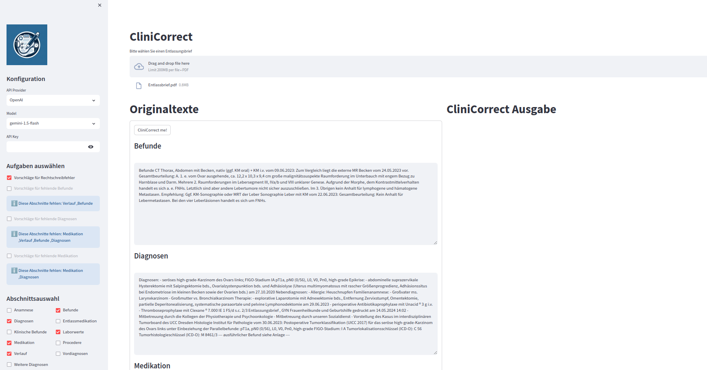
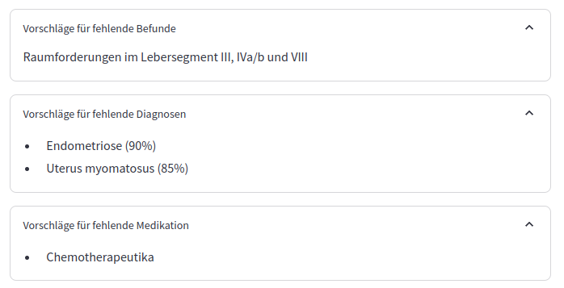

# CliniCorrect


An LLM-based application that assists physicians with evaluating the correctness and completeness of discharge letters in German. 
The application provides tools for evaluating spelling, completeness of epikrise, diagnosis, and medication. 
The project was developed as part of the task **"LLM for Patient Histories"** of the **"MedTech hackathon"**.


## Table of Contents
- [Project Description](#project-description)
- [Installation](#installation)
- [Usage](#usage)
- [Contributing](#contributing)
- [License](#license)

## Project Description
The project is a web application that assists physicians in evaluating the correctness and completeness of discharge letters in German. 
The user can upload a discharge letter and the application will provide feedback on the spelling, completeness of epikrise, diagnosis, and medication.
The fields of the discharge letter are extracted automatically, based on a language
and meta-data processing pipeline. The extracted fields are autocompleted and the user can correct them if necessary.

The application uses models from the following providers:
- OpenAI
- Google
- Ollama

The user originally selects the provider and model to be used. Subsequently, when 
needed, the user also inputs the appropriate API key, the characters of which are
by default hidden.

Subsequenlty, the user selects which tasks to perform on the discharge letter. 
Finally, the user can select to include or exclude sections that are not relevant.

The page of the application is split in two parts. The left part displays the 
original texts extracted from the report. 
The CliniCorrect outputs are displayed on the right side of the page.

The application is developed using the following technologies:
- Python
- Streamlit
- OpenAI API
- Google Cloud API
- Ollama API

### Obtaining API keys
To use the models from OpenAI and Google, the user needs to obtain an API key from the respective providers.
Please mind all costs, limitations and terms of the respectigve model providers.

- [OpenAI API](https://openai.com/index/openai-api/): Please note that using OpenAI API requires a
paid subscription. You can sign-up and follow instructions on the webpage to obtain the API key.
- [Google Gemini](https://ai.google.dev/gemini-api/docs/api-key): Google Gemini provides both a limited free API and a paid API key. Both can be used CliniCorrect. Please mind potential limitation on model and API use limits applied by the provider.
- Ollama: Ollama runs offline and locally, thus no API key is required.


## Disclaimers
- The project is still in development and is not yet ready for production.
- The project is not a substitute for a medical professional.
- The safety and correctness of the model output are not guaranteed and should be verified by a medical professional.
- The project is not a medical device and should not be used as such.
- The project is not a substitute for a medical professional.
- The developers are not responsible for any misuse of the project.
- Some of the model providers may collect data from the users. The users should be aware of the privacy policy of the model providers.
- The user is solely responsible for the data that is processed and shared with the model providers.
- Text parser was developed to fit the specific format of the discharge letters used in the hackathon. The parser may not work with other formats.

## Installation
### 1. Prerequisites:
#### Required:
- os: Windows, Linux
- python >= 3.8
- git

#### Optional:

**Ollama with llama3.1 model**

[Download Ollama](https://ollama.com/) 

[Install llama3.1](https://ollama.com/library/llama3.1)

Please, keep in mind that using Ollama localy without a graphics card can be slow.

### 2. Clone the repository:
```bash
 git clone https://github.com/iokaf/CliniCorrect-Public
```
### 3. (Suggested) Create a virtual environment and activate it:

**Linux:**
```bash
python -m venv clinicorrect
source clinicorrect/bin/activate
```

**Windows:**
```bash
python -m venv clinicorrect
clinicorrect\Scripts\activate
```

### 2. Install dependencies:
```bash
 pip install -r requirements.txt
 ```

 ## Usage
### Staring the application:
To run the project, use the following command:
```bash
streamlit run clinicorrect.py
```

### Selecting Discharge Letter:
In the original interface, click the "Browse Files" button to upload a discharge letter.


### Model Selection:
After selecting the discharge letter, the user selects the model provider, model, and provides the API key if necessary.

Subsequenlty, the tasks to be executed on the discharge letter can be selected.

Furthermore, the user can select to include or exclude sections that are not relevant.


### Extracted Text:
After selecting the discharge letter, its contents are read through the parser and presented in the interface.
All of the text fields are also modifiable by the user, allowing in-place corrections.




### Output:

The output of the selected model is displayed on the right side of the page.
For each miss-spelled word, the model provides a suggestion for the correct spelling.


Suggestions for the completion of the epikrise, diagnosis, and medication are also provided in the form of a list of possible completions.



### Updating the prompts
The prompts used for each of the models can be updated from the config.toml file. The user can change the prompts to better fit the specific use case.


### Adding models
In case more models from the same provider are available, the user can use them by adding the model name in the appropriate field in the config.toml file.


## Contributing
1. Fork the repository.
2. Create a new branch: `git checkout -b feature-name`.
3. Make your changes.
4. Include a detailed description of your changes in a changes.md file.
5. Push your branch: `git push origin feature-name`.
6. Create a pull request.

## License
This project is licensed under the [MIT License](LICENSE).

